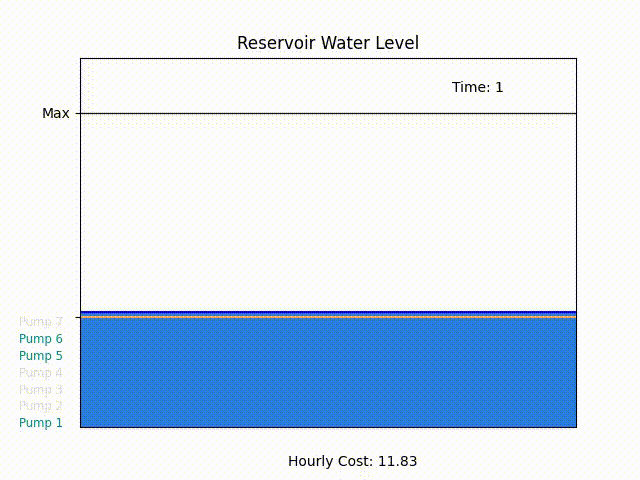

[](
  https://circleci.com/gh/dwave-examples/reservoir-management)

# Reservoir Management

Water reservoir levels must be carefully controlled to satisfy consumer demand
while maintaining minimum water levels. To satisfy this demand and maintain at
least a minimum level of water in the reservoir, pumps can be operated to
provide water flow into the reservoir. To operate these pumps there is a cost,
and we would like to choose which pumps to use throughout the day in order to
minimize cost.

In this demo scenario, we have seven pumps that can be operated on 1-hour
intervals throughout a 24-hour day.

## Usage

To run the demo, type:

```bash
python demo.py
```

The demo outputs `reservoir.html`, a video of the reservoir water levels for a
problem with seven pumps available, as shown below. This animation can be
displayed in a web browser, or if using the Leap IDE by right-clicking on the
file name and selecting "Open With" -> "Preview".



The command-line output displays which pumps are used in each time interval,
using a 0 to indicate that the pump is off and a 1 to indicate that the pump is
on. At the bottom of each time interval column is the water level at the time
so that we may confirm that it is within the allowable ranges. Lastly, the
total flow produced by the pumps over all time intervals and the total cost
over all time intervals is displayed.

## Problem Formulation

### Objective

The general objective for this problem is to minimize cost. Cost is determined
by which pumps are used in each time slot. To compute the cost for a given time
slot, we must take into consideration the amount of power required for each
pump in use as well as the cost of power at the given time. The cost per unit
of power changes at different times of day, meaning that the cost to operate a
pump also varies at different times of day. We can formulate this objective
mathematically as:

min &Sigma;<sub>t</sub> &Sigma;<sub>p</sub> c<sub>t,p</sub> x<sub>t,p</sub>

where the summations are over time slots t and pumps p, and c<sub>(t,p)</sub> is the cost
to operate pump p at time slot t.

### Constraints

This problem consists of three groups of constraints.

1. Each pump must be used at least once. This allows us to use pumps routinely
so that they do not fall into disrepair. Mathematically, this constraint can
be written as &Sigma;<sub>t</sub> x<sub>t,p</sub> &ge; 1, for each pump p.

2. Each time slot must have at least one unused pump as a backup.
Mathematically, this constraint can be written as &Sigma;<sub>p</sub> x<sub>t,p</sub> &le; |P| - 1, for each
time slot t.

3. At each time slot, the water level must be within allowable levels. To more
clearly represent this constraint mathematically, we introduce a placeholder
variable v<sub>i</sub> that represents the reservoir water level at time i. For the first
time slot, we define v<sub>1</sub> = &Sigma;<sub>p</sub> f<sub>p</sub>x<sub>1,p</sub> + V<sub>init</sub> - d<sub>1</sub>, 
where f<sub>p</sub> is the flow of pump p, V<sub>init</sub> is the initial reservoir water level, 
and d<sub>1</sub> is the consumer demand in time slot 1. For time slots after time slot 1, we define\
v<sub>i</sub> = &Sigma;<sub>p</sub> f<sub>p</sub>x<sub>i,p</sub> + v<sub>i-1</sub> - d<sub>i</sub>. 
At any given time slot t, we must enforce the constraint that V<sub>min</sub> &le; v<sub>t</sub> &le; V<sub>max</sub>.

For the full mathematical formulation of these constraints, please see the
paper cited in the References section.

## References

Kowalik, Przemysław, and Magdalena Rzemieniak. "Binary Linear Programming as a
Tool of Cost Optimization for a Water Supply Operator." Sustainability 13.6
(2021): 3470.
